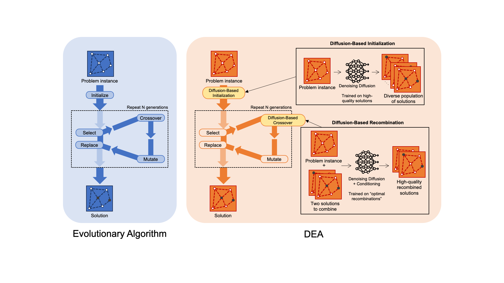

# Diffusion-Based Evolutionary Algorithms

This repository contains the code of my Master Thesis

**Abstract:** 
This work explores the integration of denoising diffusion models with evolutionary algorithms (EAs) to enhance machine learning-based combinatorial optimization. While diffusion models have shown promise as generative solvers for NP-hard problems, they often rely on problem-specific heuristics and lack the robust exploration capabilities of traditional search methods. 
To address these limitations, we propose a novel Diffusion-based Evolutionary Algorithm (DEA) framework. This approach leverages pre-trained diffusion models for both population initialization and recombination, effectively exploiting the multimodal solution space captured by diffusion models within the exploratory structure of an EA. We focus on the Maximum Independent Set (MIS) problem, developing a baseline EA and then introducing diffusion-based initialization and a diffusion recombination operator trained via imitation learning from an optimal recombination demonstrator formulated as an Integer Linear Program.
Computational experiments on Erdős-Rényi graph datasets of varying sizes demonstrate that DEA significantly outperforms standalone Difusco, a state-of-the-art diffusion-based solver for combinatorial optimization, achieving improved solution quality and better out-of-distribution generalization to larger graph instances. 
Notably, DEA outperforms the MIP solver Gurobi on larger instances when considering the same time limit, while still falling short of highly specialized classical solvers like KaMIS.
Our ablation studies highlight the crucial contributions of both diffusion-based initialization and recombination to the DEA framework's success. This work provides empirical evidence for the synergistic potential of combining diffusion models and EAs, offering a promising direction for developing more robust and effective machine learning approaches to complex combinatorial optimization problems and paving the way for future research into hybrid ML-metaheuristic methods.

**Short abstract paper**: available [here](https://jsalvasoler.vercel.app/dea_short_abstract.pdf).




-----

## Table of Contents

- [Dependencies and Installation](#dependencies-and-installation)
  - [KaMIS](#kamis)
  - [LKH](#lkh)
  - [Cython TSP heuristics](#cython-tsp-heuristics)
- [CLI Usage](#cli-usage)
- [Core Workflows](#core-workflows)
  - [1. Train or test a simple Difusco model](#1-train-or-test-a-simple-difusco-model)
  - [2. Run the evolutionary algorithm](#2-run-the-evolutionary-algorithm)
  - [3. Generate a train or test set for the diffusion recombination model](#3-generate-a-train-or-test-set-for-the-diffusion-recombination-model)
  - [4. Train or test a diffusion recombination model](#4-train-or-test-a-diffusion-recombination-model)
- [Testing](#testing)
- [Data](#data)
  - [Downloading Data](#downloading-data)
  - [Traveling Salesman Problem (TSP)](#traveling-salesman-problem-tsp)
  - [Maximum Independent Set (MIS)](#maximum-independent-set-mis)
- [Models](#models)
- [License](#license)

## Dependencies and Installation

This project uses [hatch](https://hatch.pypa.io/) as a project manager. To install it, just `pip install hatch` or `pipx install hatch`.

Unfortunately, two dependencies (`torch-scatter` and `torch-sparse`) require `torch` as an runtime dependency. The usual `hatch` dependency sync will not work for these two packages. To install them, do:

```bash

hatch shell # to create and enter the environment

pip install torch-scatter torch-sparse -f https://pytorch-geometric.com/whl/torch-2.3.1+cu121.html

```
You only need to install `torch-scatter`, `torch-sparse` once. After that, you can use `hatch run` as usual to run the project, and dependencies will sync automatically (without removing the extra installed packages).

**KaMIS**
Generating MIS datasets requires the KaMIS solver. We pull the code from the official repository and place it in the `src/mis_benchmark_framework/kamis` directory. To pull the code and compile it, run the following commands:

```bash
cd src/mis_benchmark_framework/kamis
git clone https://github.com/KarlsruheMIS/KaMIS
bash compile_withcmake.sh
```

**LKH**
Generating the data for the TSP instances requires the `lkh` solver, which is run via the python wrapper `lkh`. To install it, use the [official LKH-3 site](http://akira.ruc.dk/~keld/research/LKH-3/). Make sure to specify the ``--lkh_path`` argument pointing to the LKH-3 binary when generating the data with this solver.

**Cython TSP heuristics**
Finally, we need to compile the `cython` code for the TSP heuristics. To do so, run the following command:

```bash
./src/problems/tsp/cython_merge/compile.sh
```


## CLI Usage

There is a simple click CLI that can be used to run all the relevant modules. To see the available commands, run:

```bash
hatch run cli --help
```
The result of the command above is quite explanatory:

```bash
Usage:
 - hatch run cli difusco <subcommand>
 - hatch run cli ea <subcommand>
 - hatch run cli difuscombination <subcommand>

Commands:
 - difusco:
     run-difusco
     generate-tsp-data
     generate-node-degree-labels
     run-tsp-heuristics
     run-difusco-initialization-experiments
 - ea:
     run-ea
 - difuscombination:
     run-difuscombination
     recombination-experiments

For command-specific info, run 'hatch run cli <group> <subcommand>' --help
```

## Core Workflows

We now guide you through the main workflows of the project.

### 1. Train or test a simple Difusco model

Assume we want to test or train a simple Difusco model on a set of high-quality labels. In this case, take a look at the `src/cli_tools/scripts/train.sh` script. It is a bash script that runs the `hatch run cli difusco run-difusco` command with the appropriate arguments. You will need to modify parameters such as dataset paths, model configuration, batch size, and learning rate to match your specific requirements.

### 2. Run the evolutionary algorithm

We can run the evolutionary algorithm by running the `src/cli_tools/bash_scripts/evo.sh` script. It is a bash script that runs the `hatch run cli ea run-ea` command with the appropriate arguments. For the full DEA, a Difusco and a diffusion recombination model need to be specified through the `--cktp_path` and `--ckpt_path_difuscombination` arguments, respectively. You should modify evolutionary parameters like population size, number of generations, mutation rates, and model paths according to your specific experimental setup.

### 3. Generate a train or test set for the diffusion recombination model

We do this by running the evolutionary algorithm with the optimal recombination, and storing the results. 

This is done by running the `src/cli_tools/bash_scripts/evo.sh` script with the `--save_results` argument set to `True`. Be sure to adjust other arguments to match your dataset and experimental configuration.

Finally, we need to aggregate the results in order to generate the train and test sets for the diffusion recombination model. This is done by running the following command, which should be customized with your specific paths and parameters:

```bash
python src/data/build_difuscombination_dataset.py
 --which er_700_800 # which dataset to use (replace with your target dataset)
 --split train # train or test
 --data_dir data # where to save the final dataset (adjust to your data directory)
 --raw_data_dir data # containing the results of the evolutionary algorithm (adjust to your results directory)
 --n_select 20 # number of random examples to select for each instance (adjust as needed)
```

### 4. Train or test a diffusion recombination model

We provide the script `src/cli_tools/bash_scripts/train_difuscombination.sh` to train or test a diffusion recombination model. It is a bash script that runs the `hatch run cli difuscombination run-difuscombination` command with the appropriate arguments. It works very similarly to the basic train / test script for Difusco. You will need to modify parameters such as dataset paths, model configuration, training hyperparameters, and output directories to match your specific requirements.

## Testing

Set up the test environment by running:

```bash
hatch shell hatch-test.py3.11

pip install torch-scatter torch-sparse -f https://pytorch-geometric.com/whl/torch-2.3.1+cu121.html
```

Run the tests (in parallel if -p is specified) with:

```bash
hatch test -p
```

Some tests require the data to be present, otherwise they will be skipped. Same with cuda availability.


## Data

While path engineering allows for flexibility in script compatibility with various directory structures, we strongly recommend adhering to the following directory structure for optimal organization and ease of use:

```bash
data/                      # Directory for datasets
├── tsp/                   # TSP dataset files
│   ├── tsp500_train_concorde.txt  # Training data for TSP
│   ├── tsp1000_train_concorde.txt # Additional training data for TSP
│   └── ...                # Other TSP data files
├── mis/                   # MIS dataset files
│   ├── er_50_100/         # ER-50-100 dataset
│   │   ├── test           # Test instances
│   │   ├── test_labels    # Labels for test instances
│   │   ├── train          # Training instances
│   │   └── train_labels   # Labels for training instances
│   ├── er_700_800/        # ER-700-800 dataset
│   │   ├── test           # Test instances
│   │   ├── test_labels    # Labels for test instances
│   │   ├── train          # Training instances
│   │   └── train_labels   # Labels for training instances
│   ├── satlib/            # SATLIB dataset
│   │   ├── test           # Test instances
│   │   ├── test_labels    # Labels for test instances
│   │   ├── train          # Training instances
│   │   └── train_labels   # Labels for training instances
│   └── ...                # Other MIS data files
├── difuscombination/      # Directory for diffusion combination experiments
│   └── mis/               # MIS experiments for diffusion combination
│       ├── er_50_100/     # ER-50-100 dataset
│       │   ├── test       # Test instances directory
│       │   ├── test_labels# Labels for test instances directory
│       │   ├── train      # Training instances directory
│       │   └── train_labels# Labels for training instances directory
│       ├── er_300_400/    # ER-300-400 dataset
│       │   ├── test       # Test instances directory
│       │   ├── test_labels# Labels for test instances directory
│       │   ├── train      # Training instances directory
│       │   └── train_labels# Labels for training instances directory
│       └── er_700_800/    # ER-700-800 dataset
│           ├── test       # Test instances directory
│           ├── test_labels# Labels for test instances directory
│           ├── train      # Training instances directory
│           └── train_labels# Labels for training instances directory
└── etc/                   # Other datasets or resources
    ├── example_data.txt    # Example dataset
    └── ...                # Other miscellaneous data files
```

### Downloading Data

We provide the test sets for the TSP and MIS instances, and for the MIS diffusion recombination. 
It is available as an asset of the v1.0 release of the repository: [v1.0 release](https://github.com/jsalvasoler/difusco_dea/releases/tag/v1.0).
This is the exact downloadable: [data_release.zip](https://github.com/jsalvasoler/difusco_dea/releases/download/v1.0/data_release.zip)

To unzip the data, run the following command:

```bash
unzip data_release.zip
```


### Traveling Salesman Problem (TSP)

The downloaded data contains the testing sets for the TSP instances. The origin of the training sets are the following:

The data for the TSP comes from different sources. 
 - Files tsp{50,100}_{test,train}_concorde.txt come from [chaitjo/learning-tsp](https://github.com/chaitjo/learning-tsp) (Resources section).
 - Files tsp{500,1000,10000}_test_concorde.txt come from [Spider-scnu/TSP](https://github.com/Spider-scnu/TSP) (Dataset section).
 - Files tsp{500,1000,10000}_train_concorde.txt are generated using the following commands:

```bash
hatch run difusco generate_tsp_data \
  --min_nodes 500 \
  --max_nodes 500 \
  --num_samples 128000 \
  --batch_size 128 \
  --filename "/data/tsp/tsp500_train_concorde.txt" \
  --seed 1234 \
  --lkh_path "/path/to/lkh"
```

```bash
hatch run difusco generate_tsp_data \
  --min_nodes 1000 \
  --max_nodes 1000 \
  --num_samples 64000 \
  --batch_size 128 \
  --filename "/data/tsp/tsp1000_train_concorde.txt" \
  --seed 1234 \
  --lkh_path "/path/to/lkh"
```

```bash
hatch run difusco generate_tsp_data \
  --min_nodes 10000 \
  --max_nodes 10000 \
  --num_samples 64000 \
  --batch_size 65 \
  --filename "/data/tsp/tsp10000_train_concorde.txt" \
  --seed 1234 \
  --lkh_path "/path/to/lkh"
```

### Maximum Independent Set (MIS)

Each MIS dataset directory (e.g., er_50_100, er_300_400, er_700_800, satlib) follows the same structure containing four files:

- `test`: Contains the test graph instances
- `test_labels`: Contains the optimal/best-known solution labels for test instances
- `train`: Contains the training graph instances
- `train_labels`: Contains the optimal/best-known solution labels for training instances


The downloaded data contains the testing sets for the MIS instances. The er_700_800 and satlib datasets come from [Difusco - Sun et al. (2023)](https://github.com/Edward-Sun/DIFUSCO). The training sets, and the rest of the test / train sets are generated using the following commands:

```bash
min_nodes=700
max_nodes=800
num_graphs=163840
er_p=0.15

python -u src/mis_benchmark_framework/main.py gendata \
    random \
    None \
    /your/path/to/data_er/train \
    --model er \
    --min_n $min_nodes \
    --max_n $max_nodes \
    --num_graphs $num_graphs \
    --er_p $er_p
```

## Models

We provide the pretrained models for the TSP (initialization) and MIS (initialization and recombination) as assets of the v1.0 release of the repository: [v1.0 release](https://github.com/jsalvasoler/difusco_dea/releases/tag/v1.0).
This is the exact downloadable: [checkpoints.zip](https://github.com/jsalvasoler/difusco_dea/releases/download/v1.0/checkpoints.zip)

To unzip the models, run the following command:

```bash
unzip checkpoints.zip
```

The TSP models come from the work of [Difusco - Sun et al. (2023)](https://github.com/Edward-Sun/DIFUSCO). The MIS models for er_700_800 and satlib as well. The rest of the models are trained by us.

We recommend saving the models in the following directory structure:

```bash
├── models/                    # Directory for models
│   ├── tsp/                   # TSP models
│   ├── mis/                   # MIS models
│   └── difuscombination/      # Diffusion recombination models
│       ├── tsp/               # TSP diffusion recombination models
│       └── mis/               # MIS diffusion recombination models
```

## License

This repository is distributed under the terms of the [MIT](https://spdx.org/licenses/MIT.html) license.
